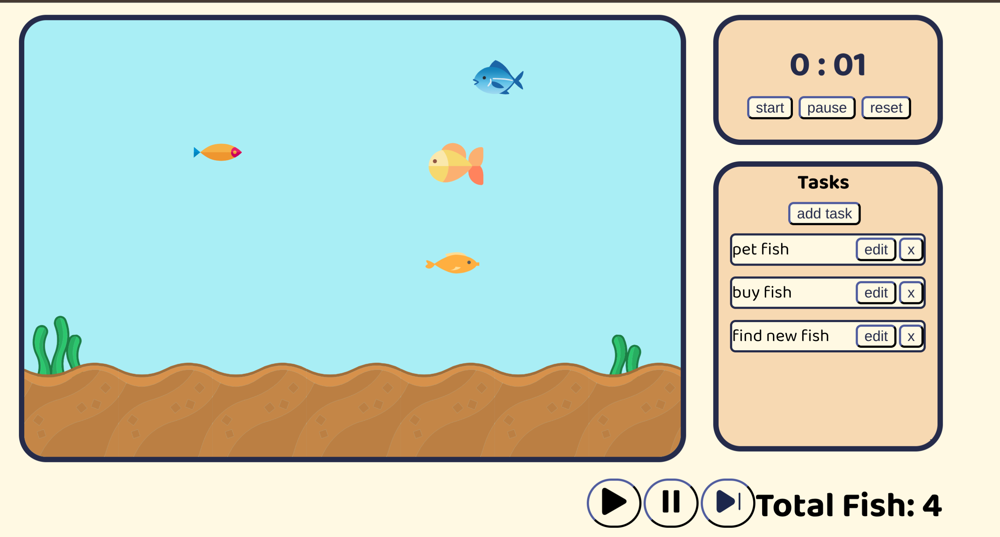

Focus Aquarium

A cute aquarium-themed pomodoro timer and task tracker to make productivity feel more rewarding, with chill and quirky lofi you can play too!

Live Site: https://froggicat.github.io/focus_aquarium/

Features:

- Pomodoro timer (where you decide the length of your focuse sessions and breaks whenever you reload the page)
- New (random!) fish appearing when a focus session is completed
- Chill background music
- Simple task tracker
- Cute aquarium design

Built with:

- HTML
- CSS
- Javascript
- Github Pages
- SVG assets from SVG repo
- Sound assets from pixabay

Built specifically for the thingondesk YSWS.